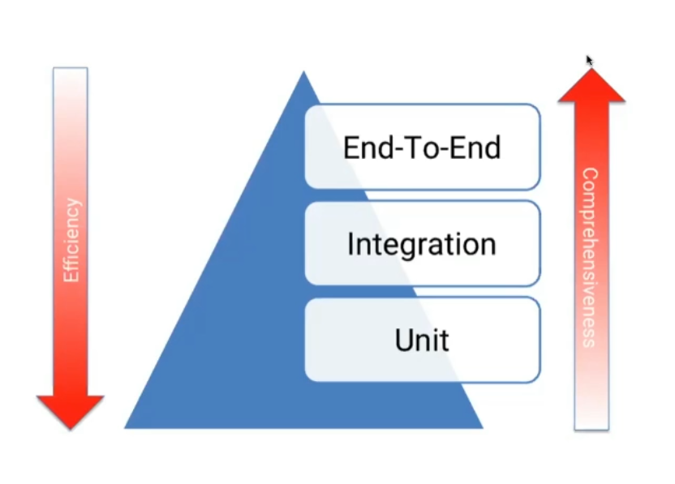

# TDD (Test Driven Development)

Tenha uma combinação de diversos tipos de testes, pois somente testes de unidade não garantem que um sistema funciona.

TDD é um método ciclíco que nos faz criar software começando pelos testes.

## Leis do TDD

- Você não pode escrever nenhum código até ter escrito um teste que detecte uma possível falha
- Você não pode escrever mais testes de unidade do que o suficiente para detectar a falha
- Você não pode escrever mais código do que o suficiente para passar nos testes

> Muitas vezes a arquitetura não é testável.

# O que fazer com arquitetura acoplada?

Um padrão de teste que tem o objetivo de substituir uma DOC (dependent-on component) em um determinado tipo de teste por motivos de performance ou segurança.

# Tipos de teste

- Dummy: objeto que criamos ppenas para completar a lista de parâmetros que precisamos passar para invocar um determinado método. Não são utilizados de fato.
- Stubs: objetos que retornam respostas prontas, definidas para um determinado teste, ajudando a isolar uma unidade
- Spies: objetos que espionam determinada execução e armazenam os resultados para verificação posterior
- Mocks: similraes a s tubs e spies e permitem que você diga exatamente o que quer que ele faça e o teste vai quebrar se isso não acontecer